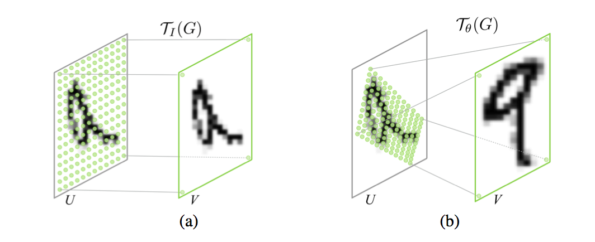
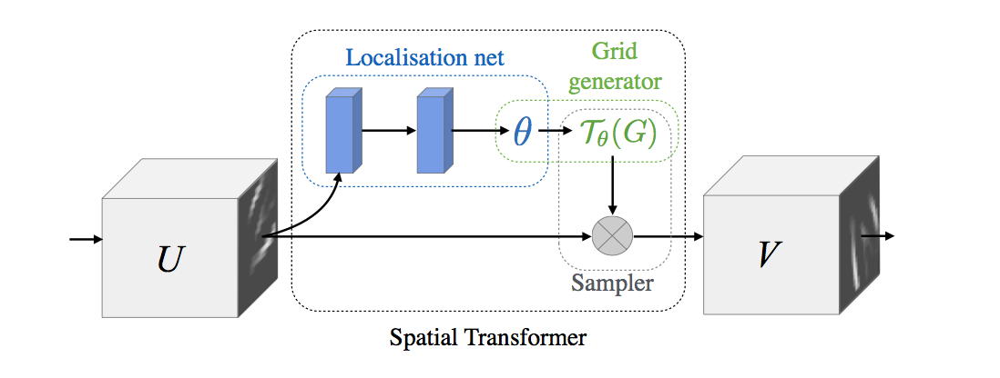
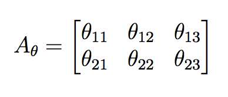
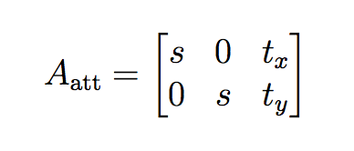

## Spatial Transformer Networks

 

This is a **PyTorch** implementation of [Spatial Transformer Networks](https://arxiv.org/abs/1506.02025) by *Max Jaderberg, Karen Simonyan, Andrew Zisserman* and *Koray Kavukcuoglu*.

*Spatial Transformer Networks* (STN) is a differentiable module that can be inserted anywhere in ConvNet architecture to increase its geometric invariance. It effectively gives the network the ability to spatially transform feature maps at no extra data or supervision cost.

## Architecture

 

The STN is composed of 3 elements.

- **localization network**: takes the feature map as input and outputs the parameters of the affine transformation that should be applied to that feature map.

- **grid generator:** generates a grid of (x,y) coordinates using the parameters of the affine transformation that correspond to a set of points where the input feature map should be sampled to produce the transformed output feature map.

- **bilinear sampler:** takes as input the input feature map and the grid generated by the grid generator and produces the output feature map using bilinear interpolation.

The affine transformation is specified through the transformation matrix A

 

It can be constrained to one of *attention* by writing it in the form

 

where the parameters `s`, `t_x` and `t_y` can be regressed to allow cropping, translation, and isotropic scaling.

